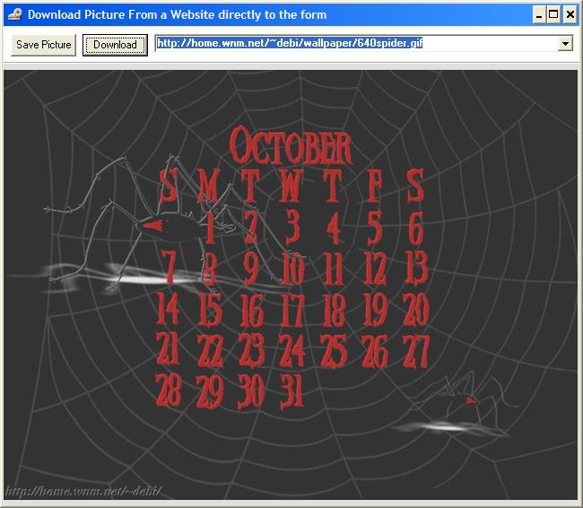



## AsyncProp Download Picture from Web to Form

### Description

This code demonstrates how to download a picture from a website and place it directly on the form,picturebox,image without having to save it first. It uses the AsyncProp "Asynchronous data transfer".
 
### More Info
 

             |
---                |---
**Submitted On**   |2002-07-15 21:53:16
**By**             |[Tolinio Christodoulou](https://github.com/Planet-Source-Code/PSCIndex/blob/master/ByAuthor/tolinio-christodoulou.md)
**Level**          |Beginner
**User Rating**    |4.8 (29 globes from 6 users)
**Compatibility**  |VB 6\.0
**Category**       |[OLE/ COM/ DCOM/ Active\-X](https://github.com/Planet-Source-Code/PSCIndex/blob/master/ByCategory/ole-com-dcom-active-x__1-29.md)
**World**          |[Visual Basic](https://github.com/Planet-Source-Code/PSCIndex/blob/master/ByWorld/visual-basic.md)
**Archive File**   |[AsyncProp\_1069087162002\.zip](https://github.com/Planet-Source-Code/tolinio-christodoulou-asyncprop-download-picture-from-web-to-form__1-36935/archive/master.zip)

